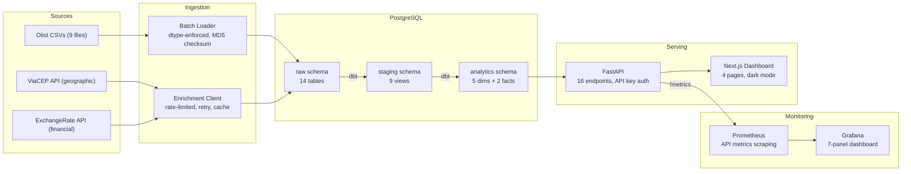
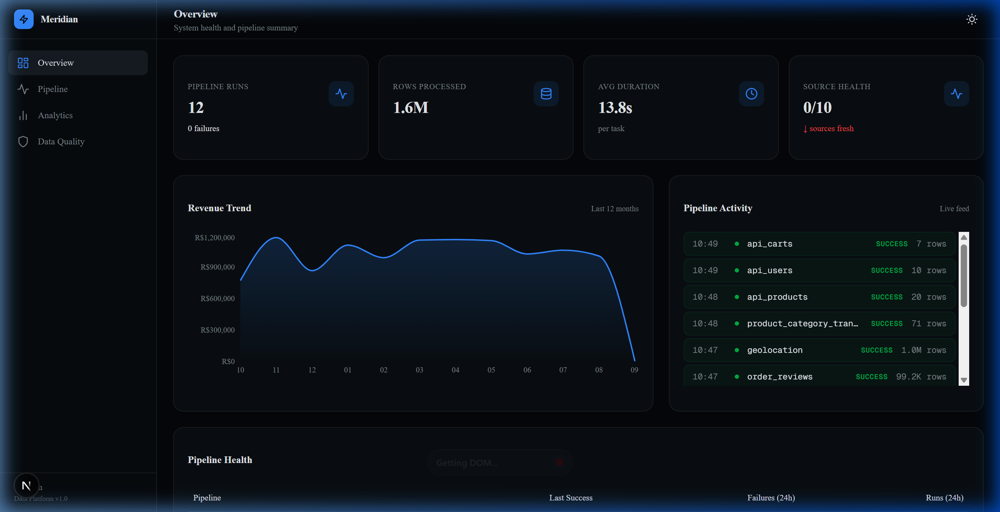
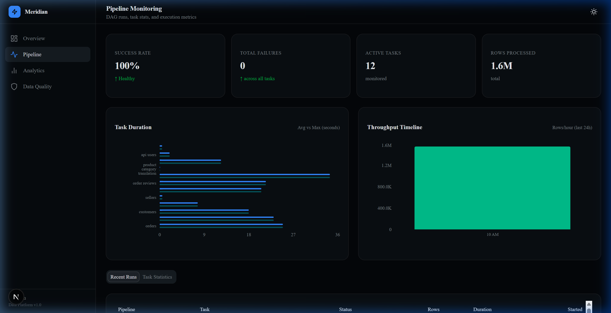
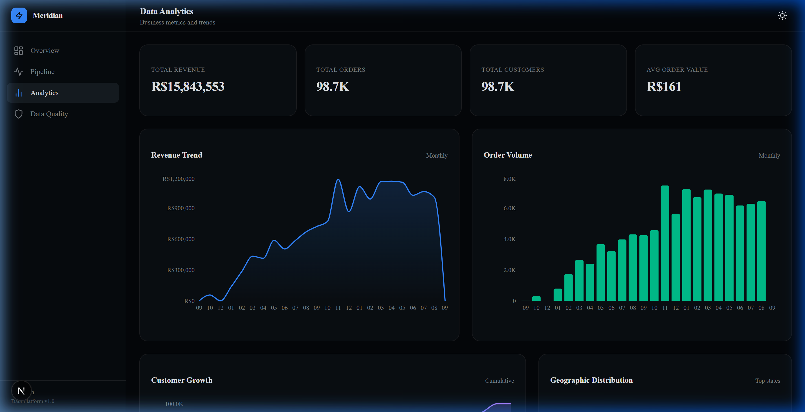
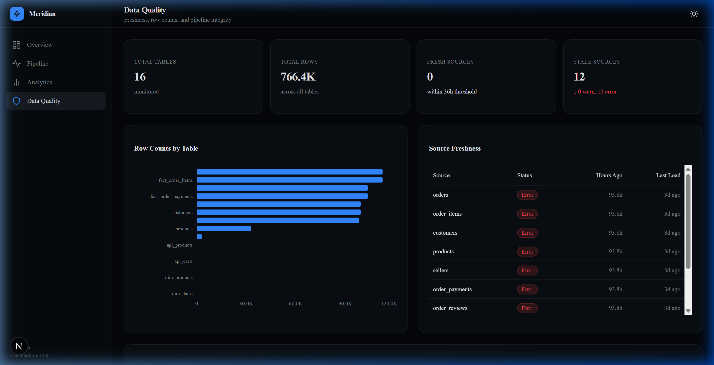
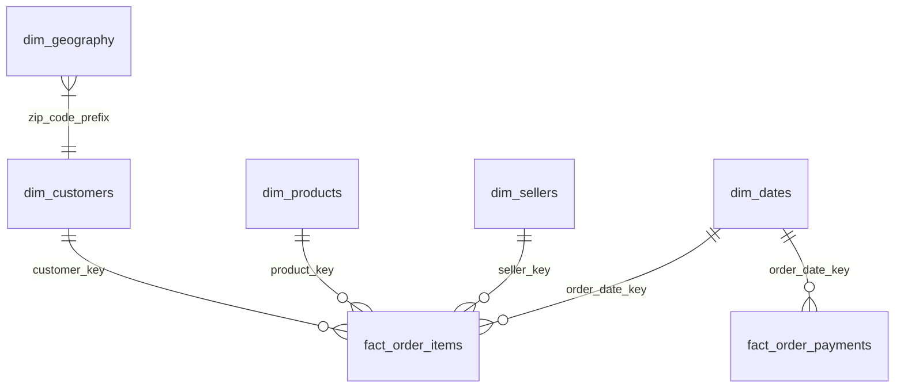
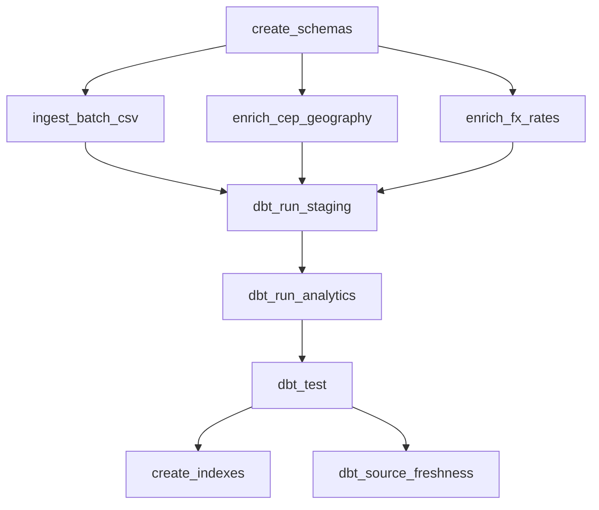

# Meridian

**Production-grade e-commerce data platform — from ingestion to insight.**

[](https://github.com/bigturtle679/E-Commerce_DataAnalytics_Platform/actions)


Multi-source data platform that ingests Brazilian e-commerce data (1.5M+ rows), enriches it with real-world geographic (ViaCEP) and financial (FX exchange rate) APIs, and serves analytics through a star schema warehouse with full monitoring.

---

## Why This Project

- **Multi-source ingestion** — batch CSV (9 files, dtype-enforced) + real-world API enrichment
- **Real-world enrichment** — ViaCEP geographic data (1000 CEPs) + BRL→USD/EUR exchange rates
- **Incremental processing** — MD5 checksum tracking, API sync state, dbt incremental models
- **Star schema warehouse** — 5 dimensions + 2 fact tables with SCD2-ready schema + FX columns
- **Monitoring** — Prometheus metrics, Grafana dashboard, pipeline observability
- **API security** — X-API-Key authentication middleware (configurable)
- **Data quality** — dbt-expectations (range checks, row counts), referential integrity, source freshness
- **Full-stack dashboard** — Next.js + FastAPI with 60s polling, dark mode, 4 monitoring views
- **Production practices** — Docker Compose, CI/CD, pre-commit hooks, typed Python + TypeScript

---

## Architecture



---

## Dashboard

<table>
  <tr>
    <td><strong>Overview</strong> — Pipeline runs, throughput, revenue trend, live activity feed</td>
    <td><strong>Pipeline</strong> — Task durations, success rates, throughput timeline, run history</td>
  </tr>
  <tr>
    <td></td>
    <td></td>
  </tr>
  <tr>
    <td><strong>Analytics</strong> — Revenue trends, order volume, customer growth, geographic distribution</td>
    <td><strong>Data Quality</strong> — Source freshness, row counts, stale source detection</td>
  </tr>
  <tr>
    <td></td>
    <td></td>
  </tr>
</table>

---

## Engineering Highlights

| Capability | Implementation |
|------------|---------------|
| **Idempotency** | `ON CONFLICT DO UPDATE` upserts, `IF NOT EXISTS` DDL, checksum-based skip |
| **Incremental processing** | File MD5 tracking, API sync state, dbt `is_incremental()` |
| **Monitoring** | Prometheus metrics via `/metrics`, Grafana dashboard (7 panels), pipeline observability |
| **API security** | `X-API-Key` header auth, configurable via env (empty = disabled for dev) |
| **Real-world enrichment** | ViaCEP (geographic), ExchangeRate API (financial), rate-limited + cached |
| **Data quality** | dbt-expectations (range, row count, pattern), referential integrity, source freshness |
| **FX conversion** | `total_amount_usd` / `total_amount_eur` columns in fact tables, live rate lookup |
| **Type safety** | Explicit `dtype_specs.py` for all CSVs, TypeScript strict mode, Pydantic schemas |
| **CI/CD** | GitHub Actions (4 jobs): lint, test, Docker build validation, integration tests |
| **Containerization** | 8-service Docker Compose with healthchecks, 3 profiles, resource limits |
| **Pre-commit** | Ruff + Black hooks, `make precommit` |

---

## Tech Stack

| Layer | Technology | Purpose |
|-------|-----------|---------| 
| **Ingestion** | Python, pandas, requests | Batch CSV + API enrichment |
| **Warehouse** | PostgreSQL 16 | Raw → Staging → Analytics (star schema) |
| **Modeling** | dbt-core + dbt-expectations | SQL-based ELT with advanced quality tests |
| **Orchestration** | Apache Airflow 2.9 | 8-task DAG, daily schedule, idempotent |
| **API** | FastAPI + psycopg2 | Read-only REST, connection pooling, API key auth |
| **Frontend** | Next.js 16, TypeScript | App Router, React Query (60s polling) |
| **UI** | TailwindCSS v4, shadcn/ui, Recharts | Dark-mode-first dashboard |
| **Monitoring** | Prometheus + Grafana | HTTP metrics, latency percentiles, error rates |
| **Enrichment** | ViaCEP, ExchangeRate API | Geographic + financial data enrichment |

---

## Quick Start

### Docker (recommended)

```bash
git clone https://github.com/bigturtle679/E-Commerce_DataAnalytics_Platform.git
cd E-Commerce_DataAnalytics_Platform

# Place Olist CSVs in ./dataset/
# Start core services
make up              # postgres + api + frontend
make verify          # check health
make seed            # ingest + transform (first time)
make enrich          # run ViaCEP + FX enrichment
```

| Service | URL |
|---------|-----|
| Dashboard | http://localhost:3000 |
| API Docs | http://localhost:8000/docs |
| Airflow | http://localhost:8080 (run `make airflow`) |
| Prometheus | http://localhost:9090 (run `make monitoring`) |
| Grafana | http://localhost:3001 (run `make monitoring`) |

### Local Development

```bash
pip install -r requirements.txt
cd frontend && npm install && cd ..

# Load data
python -m ingestion.batch.ingest_csv
python -m ingestion.api.ingest_api      # ViaCEP + FX enrichment
python -m scripts.materialize_models

# Start
uvicorn api.main:app --reload       # Terminal 1
cd frontend && npm run dev          # Terminal 2
```

---

## Data Model



| Model | Type | Rows | Source |
|-------|------|------|--------|
| `dim_customers` | Dimension | 99,441 | Olist batch |
| `dim_products` | Dimension | 32,951 | Olist batch |
| `dim_sellers` | Dimension | 3,095 | Olist batch |
| `dim_dates` | Dimension | 1,461 | Generated (2016–2019) |
| `dim_geography` | Dimension | ~1,000 | ViaCEP enrichment |
| `fact_order_items` | Fact | 112,650 | Orders × Items (+ FX columns) |
| `fact_order_payments` | Fact | 103,886 | Order payments |

---

## Enrichment APIs

| API | Purpose | Data | Rate |
|-----|---------|------|------|
| **ViaCEP** | Geographic enrichment | City, state, region, neighborhood per CEP | ~7 req/s, top 1000 CEPs |
| **ExchangeRate** | Financial conversion | BRL → USD, BRL → EUR daily rates | 1 req/day |

> **Note**: CEP enrichment is intentionally capped at the top 1,000 most-used CEPs (by customer frequency) for demo practicality. The architecture supports full enrichment of all ~15,000 unique CEPs by adjusting the `limit` parameter.

---

## Monitoring

| Component | Port | Purpose |
|-----------|------|---------|
| **Prometheus** | 9090 | Scrapes `/metrics` from FastAPI every 15s |
| **Grafana** | 3001 | 7-panel dashboard: request rate, latency p50/p95/p99, error rate, throughput |

Start monitoring: `make monitoring`

API key auth: Set `API_KEY` in `.env` to enable `X-API-Key` header validation on protected endpoints. Leave empty to disable (default for local dev).

---

## Pipeline DAG



**8 tasks** · daily schedule · `max_active_runs=1` · retries: 2 · idempotent

---

## Tradeoffs & Design Decisions

### Why PostgreSQL (not Redshift/BigQuery)?
Single-node Postgres handles the ~100K-row dataset efficiently. No cloud vendor lock-in. Identical SQL semantics between dev and production. Upgrade path is clear — swap the connection string when data exceeds 10M rows.

### Why dbt (not stored procedures)?
Version-controlled SQL transformations with built-in testing, documentation, and incremental materialization. Models are readable, testable, and portable across warehouses.

### Why real-world APIs (not synthetic)?
ViaCEP and ExchangeRate API provide coherent data that aligns with the Brazilian e-commerce dataset. Geographic enrichment adds city/state/region context. FX conversion demonstrates multi-currency analytics — both are patterns used in production data platforms.

### Why Prometheus+Grafana (not Datadog/New Relic)?
Open-source, self-hosted, zero cost. Prometheus scraping is the industry standard for containerized services. Grafana provides production-grade visualization with auto-provisioned dashboards.

### Why polling (not websockets)?
60-second React Query refetch intervals are simpler, more reliable, and sufficient for a batch pipeline that runs daily. No persistent connections to manage, no reconnection logic, no server-side event infrastructure.

### Why Docker Compose (not Kubernetes)?
Compose is the right tool for an 8-service stack. Kubernetes adds complexity (ingress, services, persistent volume claims, operators) without benefit at this scale. The compose file maps directly to production deployment.

---

## Deployment Architecture

A realistic production deployment for this platform:

| Component | Service | Rationale |
|-----------|---------|-----------| 
| **Frontend** | Vercel | Zero-config Next.js hosting, CDN, preview deploys per PR |
| **API** | Render / Fly.io | Container hosting with health checks, auto-restart, free tier |
| **PostgreSQL** | Neon / Supabase | Serverless Postgres with connection pooling, branching |
| **Airflow** | EC2 + Docker Compose | Stateful scheduler needs persistent compute; t3.medium is sufficient |
| **Monitoring** | Same EC2 instance | Prometheus + Grafana co-located with Airflow |

---

## Developer Experience

### Makefile

| Category | Commands |
|----------|----------|
| **Quality** | `make lint` · `make format` · `make test-unit` · `make ci` · `make precommit` |
| **Stack** | `make up` · `make down` · `make rebuild` · `make clean` |
| **Pipeline** | `make ingest` · `make enrich` · `make transform` · `make seed` |
| **Operations** | `make logs` · `make status` · `make verify` · `make psql` · `make airflow` · `make monitoring` |

### CI/CD

| Job | Validates |
|-----|-----------|
| Backend | Ruff lint, Black format, pytest unit tests |
| Frontend | ESLint, TypeScript, Next.js production build |
| Docker | Compose config + API/frontend image builds |
| Integration | PostgreSQL connectivity + schema creation (push only) |

---

## Project Structure

```
meridian/
├── .github/workflows/ci.yml   # CI pipeline (4 jobs)
├── docker-compose.yml          # 8-service orchestration (3 profiles)
├── Dockerfile.{api,frontend,airflow}
├── Makefile                    # Developer CLI
├── .pre-commit-config.yaml     # Ruff + Black hooks
├── pyproject.toml              # Ruff, Black, mypy, pytest config
│
├── ingestion/                  # Data ingestion layer
│   ├── batch/                  # CSV loader + dtype specs
│   ├── api/                    # ViaCEP + FX enrichment clients
│   └── utils/                  # DB, logging, metrics, performance
│
├── dbt_project/models/         # Transformation models
│   ├── staging/                # 9 views (7 batch + 2 enrichment)
│   └── analytics/              # 7 tables (5 dims + 2 facts)
│
├── api/                        # FastAPI backend (16 endpoints)
│   ├── auth.py                 # API key middleware
│   └── routers/                # pipeline, health, analytics, quality
│
├── frontend/                   # Next.js 16 dashboard (4 pages)
│   ├── app/                    # App Router pages
│   ├── components/             # UI components + dashboard
│   └── lib/                    # API client, formatters
│
├── monitoring/                 # Observability stack
│   ├── prometheus/             # Scrape config
│   └── grafana/                # Dashboard + provisioning
│
├── airflow/dags/               # 8-task orchestration DAG
├── tests/                      # Unit + integration tests
└── docs/assets/                # Dashboard screenshots
```

---

## Failure Handling

| Scenario | Behavior |
|----------|----------|
| CSV file missing | Warning logged, skipped |
| Schema mismatch | `ValueError` with column diff |
| ViaCEP timeout / 5xx | Exponential backoff retry (3 attempts) |
| FX API key invalid | Warning logged, FX columns default to 0 |
| Invalid CEP | Stored with `valid=false`, excluded from dim_geography |
| Missing DB table | API returns empty response |
| Full re-run | Safe — idempotent upserts, cached enrichment |

---

## License

Educational and portfolio project.
Dataset: [Brazilian E-Commerce by Olist](https://www.kaggle.com/datasets/olistbr/brazilian-ecommerce) · APIs: [ViaCEP](https://viacep.com.br) · [ExchangeRate API](https://www.exchangerate-api.com)
