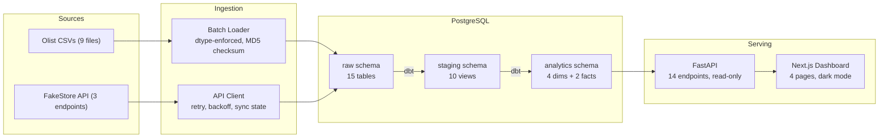
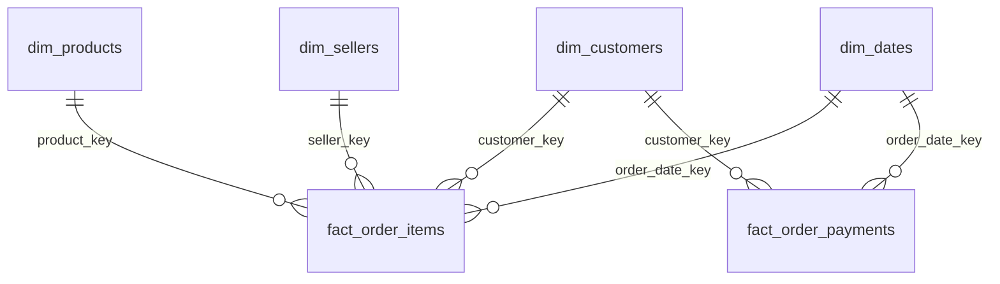
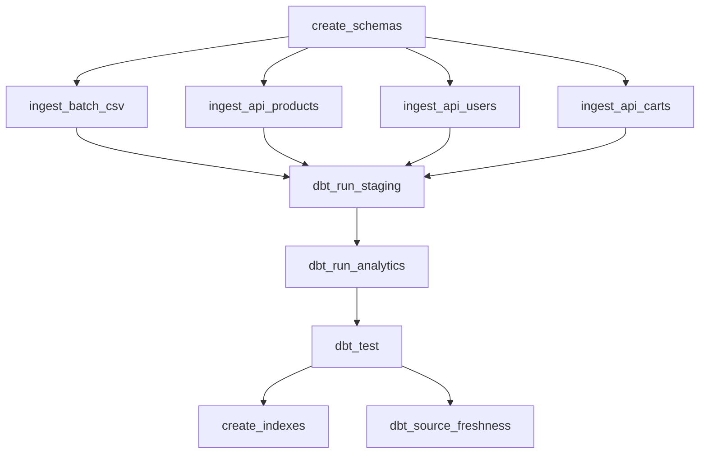

# Meridian

**Production-grade e-commerce data platform — from ingestion to insight.**

[](https://github.com/bigturtle679/E-Commerce_DataAnalytics_Platform/actions)


Multi-source data platform that ingests Brazilian e-commerce data (1.5M+ rows) and REST API data into a PostgreSQL star schema warehouse, orchestrated by Airflow, with a full-stack observability dashboard.

---

## Why This Project

- **Multi-source ingestion** — batch CSV (9 files, dtype-enforced) + REST API (3 endpoints, retry/backoff)
- **Incremental processing** — MD5 checksum tracking, API sync state, dbt incremental models
- **Star schema warehouse** — 4 dimensions + 2 fact tables with SCD2-ready schema
- **Orchestration** — 10-task Airflow DAG with idempotent execution
- **Observability** — pipeline metrics, source freshness, failure tracking
- **Full-stack dashboard** — Next.js + FastAPI with 60s polling, dark mode, 4 monitoring views
- **Production practices** — Docker Compose, CI/CD, pre-commit hooks, typed Python + TypeScript

---

## Architecture



---

## Dashboard

<table>
  <tr>
    <td><strong>Overview</strong> — Pipeline runs, throughput, revenue trend, live activity feed</td>
    <td><strong>Pipeline</strong> — Task durations, success rates, throughput timeline, run history</td>
  </tr>
  <tr>
    <td></td>
    <td></td>
  </tr>
  <tr>
    <td><strong>Analytics</strong> — Revenue trends, order volume, customer growth, geographic distribution</td>
    <td><strong>Data Quality</strong> — Source freshness, row counts, stale source detection</td>
  </tr>
  <tr>
    <td></td>
    <td></td>
  </tr>
</table>

---

## Engineering Highlights

| Capability | Implementation |
|------------|---------------|
| **Idempotency** | `ON CONFLICT DO UPDATE` upserts, `IF NOT EXISTS` DDL, checksum-based skip |
| **Incremental processing** | File MD5 tracking, API sync state, dbt `is_incremental()` |
| **Observability** | `track_pipeline()` context manager → `raw._pipeline_metrics` table |
| **Data quality** | dbt schema tests, referential integrity (FK → PK), source freshness |
| **Type safety** | Explicit `dtype_specs.py` for all CSVs, TypeScript strict mode, Pydantic schemas |
| **CI/CD** | GitHub Actions (4 jobs): lint, test, Docker build validation, integration tests |
| **Containerization** | 6-service Docker Compose with healthchecks, profiles, resource limits |
| **Pre-commit** | Ruff + Black hooks, `make precommit` |

---

## Tech Stack

| Layer | Technology | Purpose |
|-------|-----------|---------|
| **Ingestion** | Python, pandas, requests | Batch CSV + REST API fetching |
| **Warehouse** | PostgreSQL 16 | Raw → Staging → Analytics (star schema) |
| **Modeling** | dbt-core | SQL-based ELT with tests and freshness |
| **Orchestration** | Apache Airflow 2.9 | 10-task DAG, daily schedule, idempotent |
| **API** | FastAPI + psycopg2 | Read-only REST, connection pooling |
| **Frontend** | Next.js 16, TypeScript | App Router, React Query (60s polling) |
| **UI** | TailwindCSS v4, shadcn/ui, Recharts | Dark-mode-first dashboard |

---

## Quick Start

### Docker (recommended)

```bash
git clone https://github.com/bigturtle679/E-Commerce_DataAnalytics_Platform.git
cd E-Commerce_DataAnalytics_Platform

# Place Olist CSVs in ./dataset/
# Start core services
make up              # postgres + api + frontend
make verify          # check health
make seed            # ingest + transform (first time)
```

| Service | URL |
|---------|-----|
| Dashboard | http://localhost:3000 |
| API Docs | http://localhost:8000/docs |
| Airflow | http://localhost:8080 (run `make airflow`) |

### Local Development

```bash
pip install -r requirements.txt
cd frontend && npm install && cd ..

# Load data
python -m ingestion.batch.ingest_csv
python -m ingestion.api.ingest_api
python -m scripts.materialize_models

# Start
uvicorn api.main:app --reload       # Terminal 1
cd frontend && npm run dev          # Terminal 2
```

---

## Data Model



| Model | Type | Rows | Source |
|-------|------|------|--------|
| `dim_customers` | Dimension | 99,451 | Olist + FakeStore (merged) |
| `dim_products` | Dimension | 32,971 | Olist + FakeStore (merged) |
| `dim_sellers` | Dimension | 3,095 | Olist |
| `dim_dates` | Dimension | 1,461 | Generated (2016–2019) |
| `fact_order_items` | Fact | 112,650 | Orders × Items |
| `fact_order_payments` | Fact | 103,886 | Order payments |

---

## Pipeline DAG



**10 tasks** · daily schedule · `max_active_runs=1` · retries: 2 · idempotent

---

## Tradeoffs & Design Decisions

### Why PostgreSQL (not Redshift/BigQuery)?
Single-node Postgres handles the ~100K-row dataset efficiently. No cloud vendor lock-in. Identical SQL semantics between dev and production. Upgrade path is clear — swap the connection string when data exceeds 10M rows.

### Why dbt (not stored procedures)?
Version-controlled SQL transformations with built-in testing, documentation, and incremental materialization. Models are readable, testable, and portable across warehouses.

### Why Airflow (not Prefect/Dagster)?
Industry standard with the largest ecosystem. PythonOperator + BashOperator covers all use cases without custom infrastructure. SequentialExecutor is sufficient for this workload.

### Why polling (not websockets)?
60-second React Query refetch intervals are simpler, more reliable, and sufficient for a batch pipeline that runs daily. No persistent connections to manage, no reconnection logic, no server-side event infrastructure.

### Why Docker Compose (not Kubernetes)?
Compose is the right tool for a 6-service stack. Kubernetes adds complexity (ingress, services, persistent volume claims, operators) without benefit at this scale. The compose file maps directly to production deployment.

---

## Deployment Architecture

A realistic production deployment for this platform:

| Component | Service | Rationale |
|-----------|---------|-----------|
| **Frontend** | Vercel | Zero-config Next.js hosting, CDN, preview deploys per PR |
| **API** | Render / Fly.io | Container hosting with health checks, auto-restart, free tier |
| **PostgreSQL** | Neon / Supabase | Serverless Postgres with connection pooling, branching |
| **Airflow** | EC2 + Docker Compose | Stateful scheduler needs persistent compute; t3.medium is sufficient |

```
              ┌─────────────────────────────────┐
              │         Vercel (CDN)             │
              │       Next.js Frontend           │
              └──────────┬──────────────────────┘
                         │ HTTPS
              ┌──────────▼──────────────────────┐
              │     Render / Fly.io              │
              │     FastAPI (read-only)          │
              └──────────┬──────────────────────┘
                         │ TCP/5432
              ┌──────────▼──────────────────────┐
              │    Neon / Supabase               │
              │    PostgreSQL (managed)          │
              └──────────┬──────────────────────┘
                         │
              ┌──────────▼──────────────────────┐
              │    EC2 (t3.medium)               │
              │    Airflow + Ingestion           │
              │    (Docker Compose)              │
              └─────────────────────────────────┘
```

---

## Developer Experience

### Makefile

| Category | Commands |
|----------|----------|
| **Quality** | `make lint` · `make format` · `make test-unit` · `make ci` · `make precommit` |
| **Stack** | `make up` · `make down` · `make rebuild` · `make clean` |
| **Pipeline** | `make ingest` · `make transform` · `make seed` |
| **Operations** | `make logs` · `make status` · `make verify` · `make psql` · `make airflow` |

### CI/CD

| Job | Validates |
|-----|-----------|
| Backend | Ruff lint, Black format, pytest unit tests |
| Frontend | ESLint, TypeScript, Next.js production build |
| Docker | Compose config + API/frontend image builds |
| Integration | PostgreSQL connectivity + schema creation (push only) |

### Dependency Structure

| File | Purpose |
|------|---------|
| `requirements.txt` | Python runtime (pandas, sqlalchemy, psycopg2, requests) |
| `requirements-dev.txt` | Dev tooling (ruff, black, pytest, mypy, pre-commit) |
| `api/requirements.txt` | API-specific (fastapi, uvicorn, pydantic) |
| `Dockerfile.airflow` | Reads `requirements.txt` (single source of truth) |

---

## Project Structure

```
meridian/
├── .github/workflows/ci.yml   # CI pipeline (4 jobs)
├── docker-compose.yml          # 6-service orchestration
├── Dockerfile.{api,frontend,airflow}
├── Makefile                    # Developer CLI
├── .pre-commit-config.yaml     # Ruff + Black hooks
├── pyproject.toml              # Ruff, Black, mypy, pytest config
├── requirements.txt            # Runtime deps
├── requirements-dev.txt        # Dev tooling
│
├── ingestion/                  # Data ingestion layer
│   ├── batch/                  # CSV loader + dtype specs
│   ├── api/                    # FakeStore client + ingestion
│   └── utils/                  # DB, logging, metrics, performance
│
├── dbt_project/models/         # Transformation models
│   ├── staging/                # 10 views (7 batch + 3 API)
│   └── analytics/              # 6 tables (4 dims + 2 facts)
│
├── api/                        # FastAPI backend (14 endpoints)
│   └── routers/                # pipeline, health, analytics, quality
│
├── frontend/                   # Next.js 16 dashboard (4 pages)
│   ├── app/                    # App Router pages
│   ├── components/             # UI components + dashboard
│   └── lib/                    # API client, formatters
│
├── airflow/dags/               # 10-task orchestration DAG
├── tests/                      # Unit + integration tests
└── docs/assets/                # Dashboard screenshots
```

---

## Failure Handling

| Scenario | Behavior |
|----------|----------|
| CSV file missing | Warning logged, skipped |
| Schema mismatch | `ValueError` with column diff |
| API timeout / 5xx | Exponential backoff retry |
| Missing DB table | API returns empty response |
| Full re-run | Safe — idempotent upserts everywhere |

---

## License

Educational and portfolio project.
Dataset: [Brazilian E-Commerce by Olist](https://www.kaggle.com/datasets/olistbr/brazilian-ecommerce) · API: [FakeStore API](https://fakestoreapi.com)
